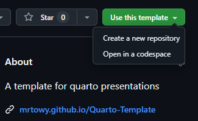
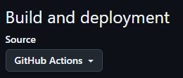

> [!TIP]
> Full presentation with examples can be found [here](https://github.com/MrToWy/BachelorKolloquium/)

# Setup your repository
1. Click on "Create a new repository"


2. Consider giving this repository a star, so you can find it later in your starred repositories
3. Enable GitHub Pages in your repository settings

4. Edit index.qmd to your needs


# Install Quarto
https://quarto.org/docs/get-started/

## Render to HTML

```shell
quarto render .\slides.qmd
```

## Show preview in browser

```shell
quarto preview .\slides.qmd
```

## Open Speaker View
change to /index-speaker.html (e.g. https://mrtowy.github.io/BachelorKolloquium/index-speaker.html)

-> Speaker View gets synchronized to normal views
